# Overview

[](https://github.com/shockwavemk/nd082-Azure-Cloud-DevOps-Starter-Code/actions/workflows/pythonapp.yml)

Second project of udacity devops nanodegree programm.

1. Building a CI pipeline using github actions
2. Building a Azure Pipeline for a machine learning application

## Project Plan

- A link to a [Trello board](https://trello.com/b/VkWFu0cR/nd082-azure-cloud-devops) for the project
- A link to a [spreadsheet](./project-management.xlsx) that includes the original and final project plan>

## Instructions

- Architectural Diagram (Shows how key parts of the system work)
  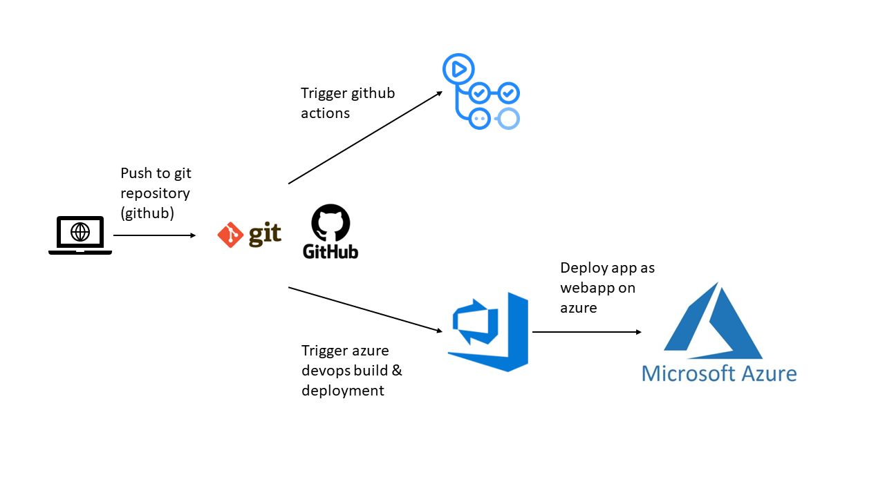

- Project cloned into Azure Cloud Shell

  - Open Azure Cloud Shell bash. Create a SSH key pair using the az sshkey method.

    ```bash
    az sshkey create --name "udacity-ssh-key" --resource-group "udacity" --tags 'udacity=c2'
    ```

    Output is like this:

    ```bash
    No public key is provided. A key pair is being generated for you.
    Private key is saved to "/home/martin/.ssh/1691049080_7002935".
    Public key is saved to "/home/martin/.ssh/1691049080_7002935.pub".
    ```

    ```json
    {
      "id": "/subscriptions/848baf1b-afe1-4486-aa6c-1544eadf1fb6/resourceGroups/UDACITY/providers/Microsoft.Compute/sshPublicKeys/udacity-ssh-key",
      "location": "westeurope",
      "name": "udacity-ssh-key",
      "publicKey": "ssh-rsa AAAAB3Nza<...>KB8AU= generated-by-azure",
      "resourceGroup": "UDACITY",
      "tags": {
        "udacity": "c2"
      },
      "type": null
    }
    ```

  - Copy and paste the publicKey to github.com

  - Add the private key to gitconfig

    ```bash
    nano ~/.ssh/config
    ```

    Add gitconfig

    ```config
    host github.com
    user git
    identityfile ~/.ssh/1691049080_7002935
    ```

  - Run `git clone git@github.com:shockwavemk/nd082-Azure-Cloud-DevOps-Starter-Code.git` to clone the repository into Azure Cloud Shell:

    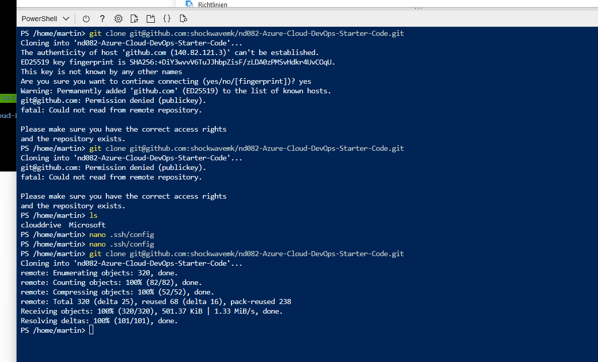

- Create virtual environment

    - Change directory to project directory and make setup:

    ```bash
    cd nd082-Azure-Cloud-DevOps-Starter-Code/C2-AgileDevelopmentwithAzure/project/starter_files/flask-sklearn/

    make setup
    ```

- Passing tests that are displayed after running the `make all` command from the `Makefile`

  - Change directory to project directory and make all:
  
    ```bash
    cd nd082-Azure-Cloud-DevOps-Starter-Code/C2-AgileDevelopmentwithAzure/project/starter_files/flask-sklearn/

    make all
    ```

  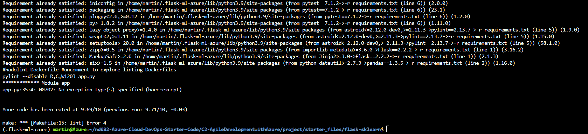

  - Output of testrun:

  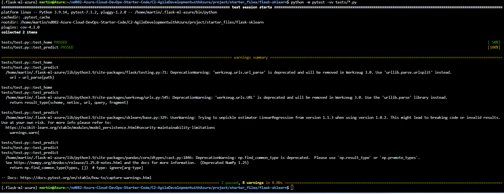

- Running on Azure App Service

  - Change directory to project directory:
  
    ```bash
    cd nd082-Azure-Cloud-DevOps-Starter-Code/C2-AgileDevelopmentwithAzure/project/starter_files/flask-sklearn/
    ```

  - Run the Azure Webapp Service

    Modify the commands.sh and replace the name of the app

    ```bash
    ./commands.sh
    ```

    or

    ```bash
    az webapp up --sku F1 --name udacity-c2-<a-free-name> --location "westeurope" 
    ```

    The webapp name results in `udacity-c2-<a-free-name>`

  - Wait until webapp is created (takes some time) and verify frontend:

    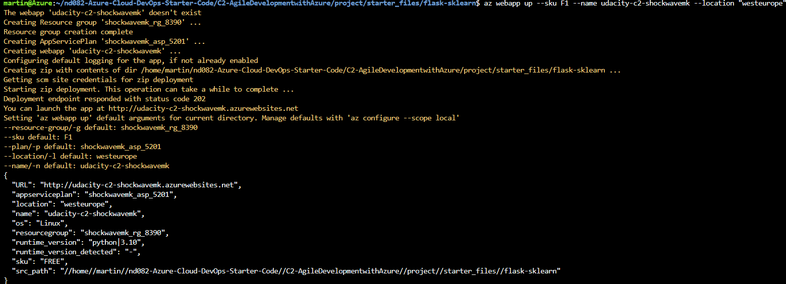

    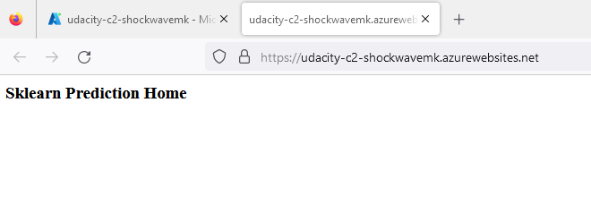

    - Update file [make_predict_azure_app.sh](make_predict_azure_app.sh) with  name `udacity-c2-<a-free-name>` in the POST target

- Successful deploy of the project in Azure Pipelines. [Note the official documentation should be referred to and double checked as you setup CI/CD](https://docs.microsoft.com/en-us/azure/devops/pipelines/ecosystems/python-webapp?view=azure-devops).

  - Create service connection

    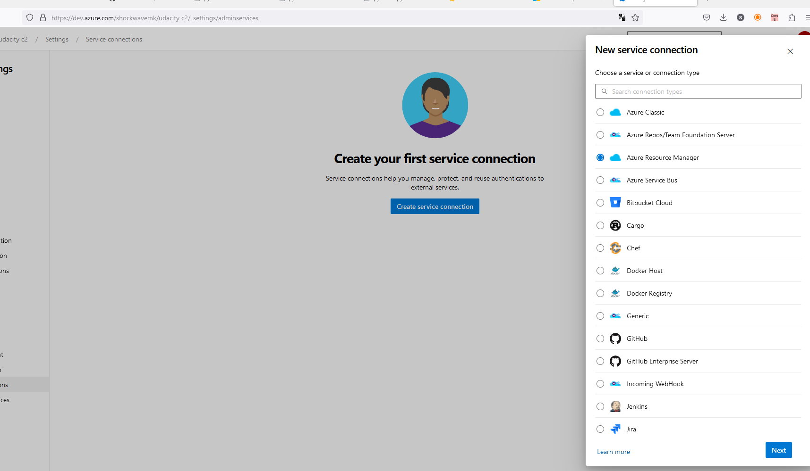

    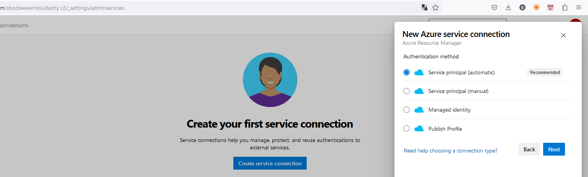

    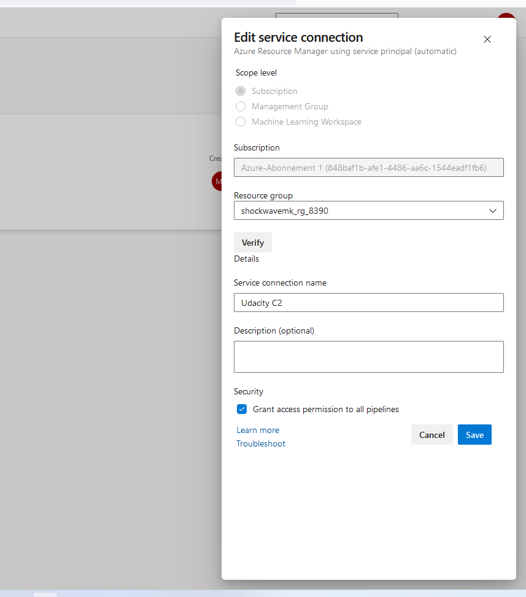

  - Checkout the Azure Pipelines configuration yaml file: [azure-pipelines.yml](../../../../azure-pipeline.yml)

- Running Azure App Service from Azure Pipelines automatic deployment

  For security reasons, azure piplines does not allow execution of any piplines without filling out this form and wait 1-3 business days https://aka.ms/azpipelines-parallelism-request

  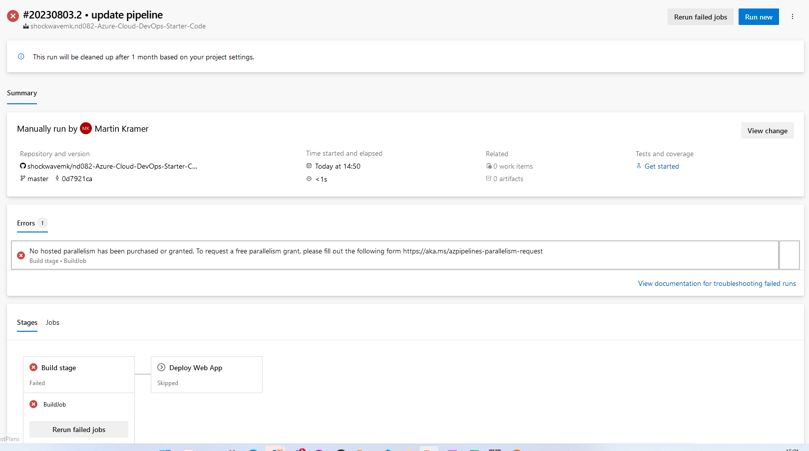

  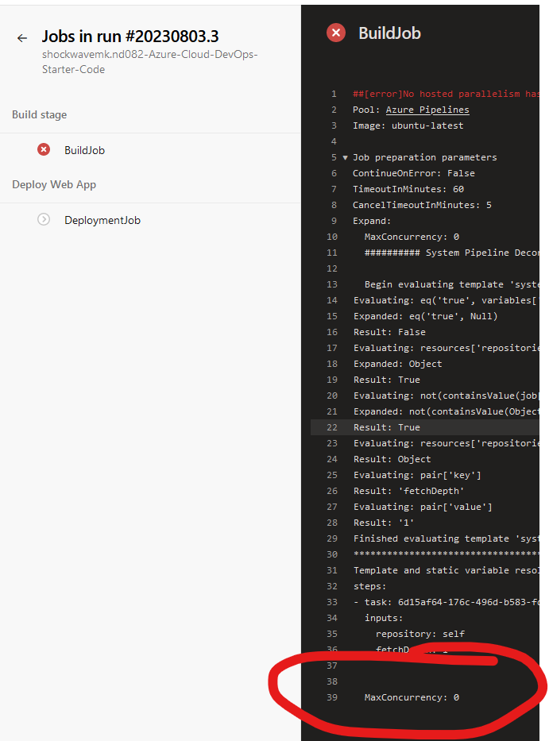

  After changing for paid hosted worker machines and some time waiting for available workers:

  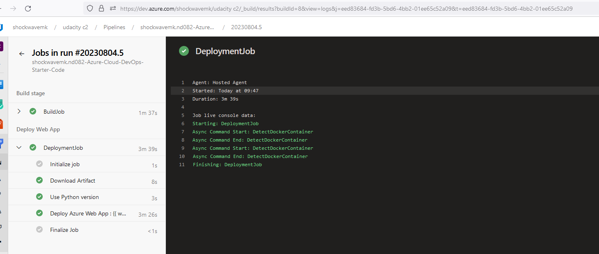

- Successful prediction from deployed flask app in Azure Cloud Shell. [Use this file as a template for the deployed prediction](https://github.com/udacity/nd082-Azure-Cloud-DevOps-Starter-Code/blob/master/C2-AgileDevelopmentwithAzure/project/starter_files/flask-sklearn/make_predict_azure_app.sh).

  The output should look similar to this:

  ```bash
  udacity@Azure:~$ ./make_predict_azure_app.sh
  Port: 443
  {"prediction":[20.35373177134412]}
  ```

  ```bash
  chmod +x make_predict_azure_app.sh
  ./make_predict_azure_app.sh
  ```

  Deploy again and make prediction:

  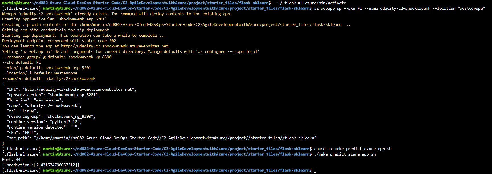

- Output of log files

  - Find id of deployed webapp:

    ```bash
    az webapp list
    ```

    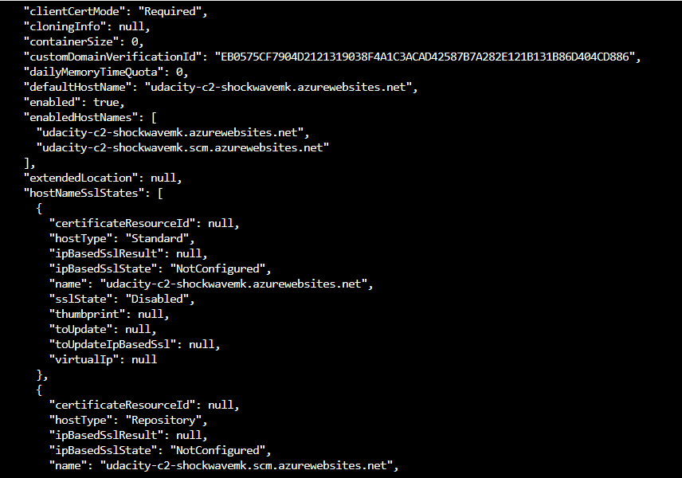

  - Start live log tracing for a webapp by:

    ```bash
    az webapp log tail --ids /subscriptions/<your-subscription>/resourceGroups/<resource-group>/providers/Microsoft.Web/sites/udacity-c2-<a-free-name>
    ```

    Download:
  
    ```bash
    az webapp log download --ids /subscriptions/<your-subscription>/resourceGroups/<resource-group>/providers/Microsoft.Web/sites/udacity-c2-<a-free-name>
    ```

- Load test web application using Locust

  - Create a virtual environment
  
    ```bash
    python3 -m venv .locust
    ```

  - Activate virtual environment

    ```bash
    source .locust/bin/activate
    ```

  - Install locust with pip
  
    ```bash
    pip install locust
    ```

  - Change directory into project files

    ```bash
    cd nd082-Azure-Cloud-DevOps-Starter-Code/C2-AgileDevelopmentwithAzure/project/starter_files/flask-sklearn/
    ```

  - Run locust

    ```bash
    locust --headless --users 1 --spawn-rate 1 -H https://udacity-c2-<a-free-name>.azurewebsites.net
    ```

  - See results in console

    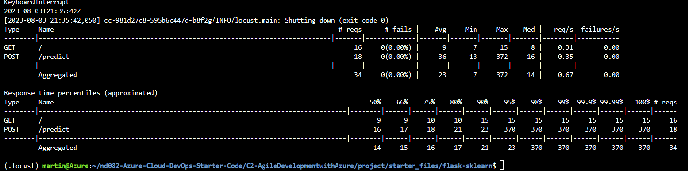

## Enhancements

- Make a container and upload it to a container registry on azure
- Make a helm chart in order to start it on Kubernetes / Azure AKS

## Demo
- [Demo short version (< 5 minutes)](https://www.youtube.com/watch?v=Y3zoXvH_YD4)
